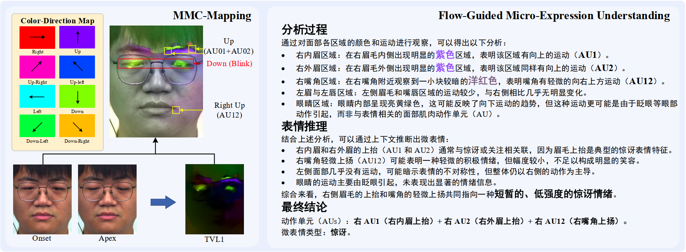
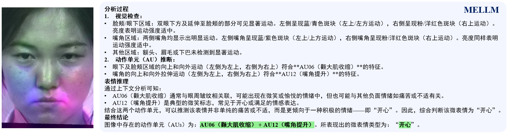
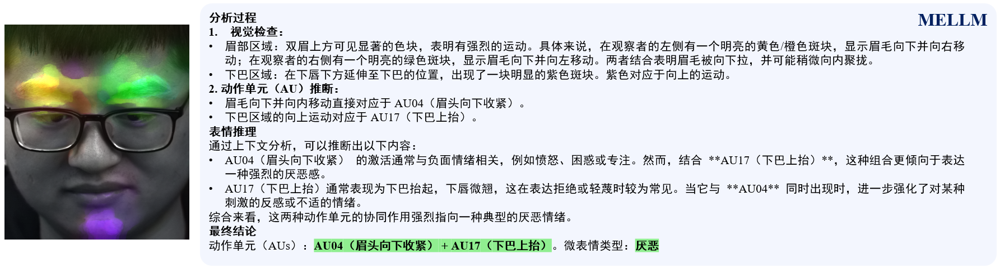
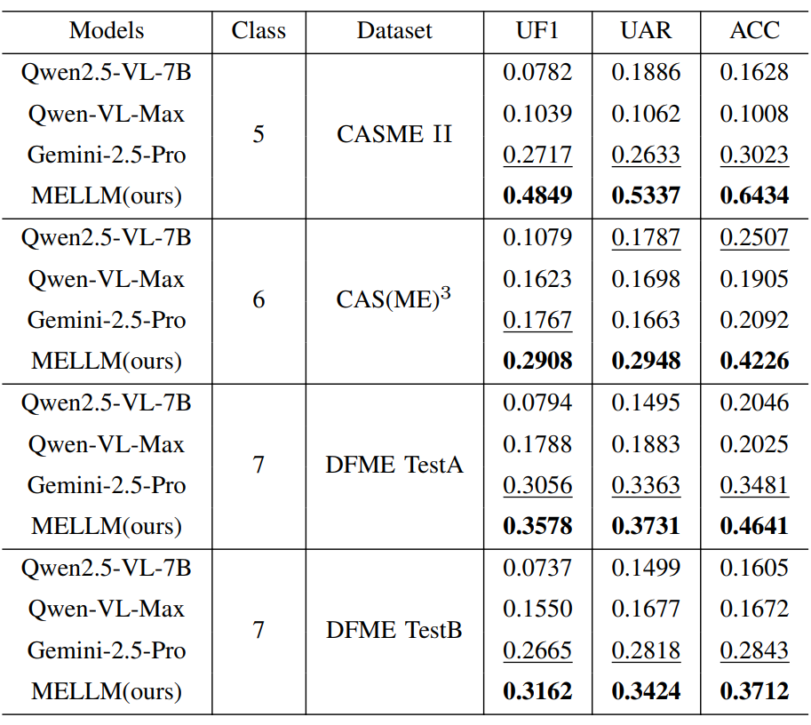
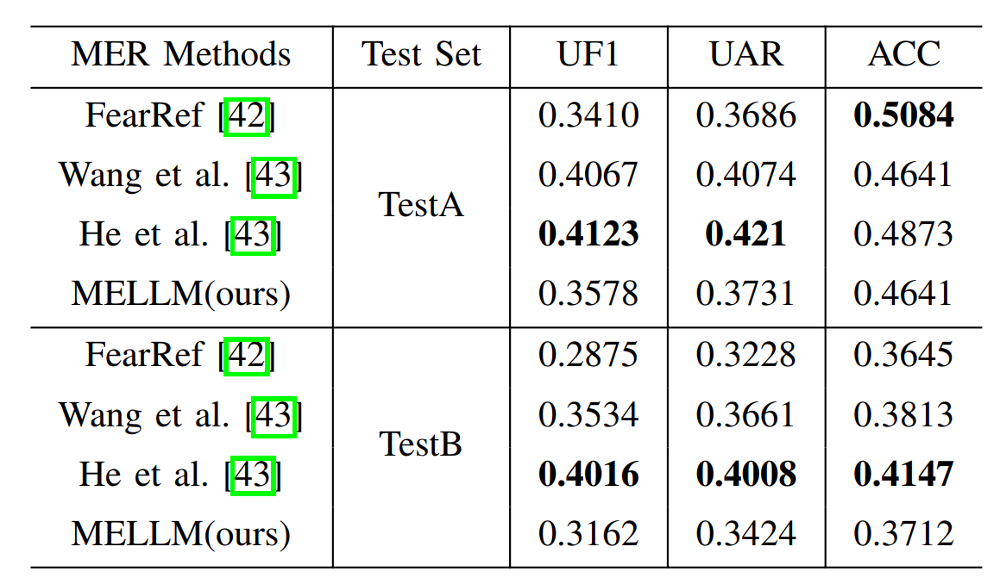

# MELLM: Exploring LLM-Powered Micro-Expression Understanding Enhanced by Subtle Motion Perception

<p align="center">
    
</p>

<div align="center">
  <a href="https://arxiv.org/pdf/2505.07007">📄  [Read our arXiv Paper] </a>
</div>

***
<p align="center">
    
</p>

> Micro-expressions (MEs) are crucial psychological responses with significant potential for affective computing. However, current automatic micro-expression recognition (MER) research primarily focuses on discrete emotion classification, neglecting a convincing analysis of the subtle dynamic movements and inherent emotional cues. The rapid progress in multimodal large language models (MLLMs), known for their strong multimodal comprehension and language generation abilities, offers new possibilities. MLLMs have shown success in various vision-language tasks, indicating their potential to understand MEs comprehensively, including both fine-grained motion patterns and underlying emotional semantics. Nevertheless, challenges remain due to the subtle intensity and short duration of MEs, as existing MLLMs are not designed to capture such delicate frame-level facial dynamics. In this paper, we propose a novel Micro-Expression Large Language Model (MELLM), which incorporates a subtle facial motion perception strategy with the strong inference capabilities of MLLMs, representing the first exploration of MLLMs in the domain of ME analysis. Specifically, to explicitly guide the MLLM toward motion-sensitive regions, we construct an interpretable motion-enhanced color map by fusing onset-apex optical flow dynamics with the corresponding grayscale onset frame as the model input. Additionally, specialized fine-tuning strategies are incorporated to further enhance the model's visual perception of MEs. Furthermore, we construct an instruction-description dataset based on Facial Action Coding System (FACS) annotations and emotion labels to train our MELLM. Comprehensive evaluations across multiple benchmark datasets demonstrate that our model exhibits superior robustness and generalization capabilities in ME understanding (MEU). 

## 📈Evaluation
We evaluate our model on the DFME TestA (474 samples) and TestB (299 samples) sets. To test generalization, we also perform zero-shot evaluation on CASME II and CAS(ME)<sup>3</sup>, which were not used during training.

<p align="center">
    
</p>

<p align="center">
    
</p>


- Comparision with other MLLMs
<p align="center">
    
</p>

- Comparision with expert models
<p align="center">
    
</p>

## ⚙️Usage
- coming soon

## 📑Citation
If you find our project helpful to your research, please consider citing:
```
@misc{zhang2025mellmexploringllmpoweredmicroexpression,
      title={MELLM: Exploring LLM-Powered Micro-Expression Understanding Enhanced by Subtle Motion Perception}, 
      author={Zhengye Zhang and Sirui Zhao and Shifeng Liu and Shukang Yin and Xinglong Mao and Tong Xu and Enhong Chen},
      year={2025},
      eprint={2505.07007},
      archivePrefix={arXiv},
      primaryClass={cs.CV},
      url={https://arxiv.org/abs/2505.07007}, 
}
```
