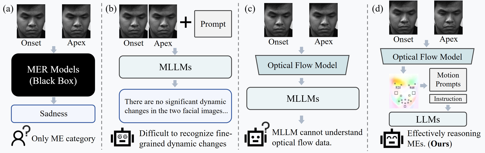

# MELLM: Exploring LLM-Powered Micro-Expression Understanding Enhanced by Subtle Motion Perception

[](https://arxiv.org/abs/2505.07007)
[](LICENSE)
[](https://www.python.org/downloads/)

We proposed a novel Micro-expressions Large Language Model (MELLM) for ME Understanding, particularly in interpreting subtle facial dynamics and underlying emotional cues.


<p align="center">
  
</p>


## Installation

### 1. Prerequisites

*   Python == 3.12

### 2. Install

```bash
conda create -n mellm python=3.12.2
conda activate mellm

git clone https://github.com/zyzhangUstc/MELLM.git
cd MELLM_pipeline
pip install -r requirements.txt
```
install OpenFace-3.0 from https://github.com/CMU-MultiComp-Lab/OpenFace-3.0

### 3. Prepare Model Weights
download weights from 
link：https://pan.ustc.edu.cn/share/index/60a8dfef271b4cd99c3e?p=1
password：8888

and

link：https://pan.ustc.edu.cn/share/index/33be577e4e6648bab96a?p=1
password：8888

put them into ckpt fold

## Demo
```bash
python pipeline.py
```

## Dataset and Training
The training code and dataset will be released as open-source upon acceptance of the paper.

## Acknowledgements
This project relies on code from existing repositories: princeton-vl/WAFT
 and Qwen3. We thank the original authors for their excellent work.


## Citation

If you find our project helpful to your research, please consider citing:
```bash
 @misc{zhao2025mellmexploringllmpoweredmicroexpression,
      title={MELLM: Exploring LLM-Powered Micro-Expression Understanding Enhanced by Subtle Motion Perception}, 
      author={Sirui Zhao and Zhengye Zhang and Shifeng Liu and Xinglong Mao and Shukang Yin and Chaoyou Fu and Tong Xu and Enhong Chen},
      year={2025},
      eprint={2505.07007},
      archivePrefix={arXiv},
      primaryClass={cs.CV},
      url={https://arxiv.org/abs/2505.07007}, 
}
```

